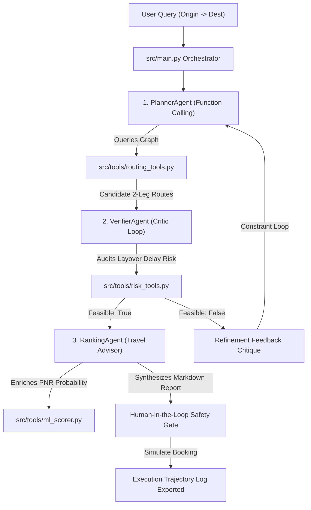

# RailRouteAgent: Multi-Agent Graph Search & Risk Audit Engine

> An agentic Indian Railways (IRCTC) split-journey planner designed to uncover high-probability, operationally safe transfer itineraries when direct train tickets are sold out or heavily waitlisted.

---

## 🎯 The Problem & User Value

Long-distance railway travel across India experiences massive demand spikes, leaving direct train tickets in popular classes (`3A`, `2A`, `SL`) in **REGRET** or high waitlist status (`GNWL-88`, `WL-50`). 

### The IRCTC Bottleneck
- **No Split-Journey Discovery**: Standard IRCTC booking portals search strictly for single direct trains or predefined through-routes. They do not suggest 2-leg transfer journeys via intermediate hub junctions (e.g. traveling from New Delhi to Madgaon via Mumbai CSMT or Bhopal).
- **The Tatkal Rush Impossible Manual Search**: Manually computing layover times, checking platform transfer buffers, accounting for historical delays, and booking 2 separate train tickets during tight Tatkal windows is cognitive overload and operationally impossible for human passengers.

### User Value Delivered
`RailRouteAgent` automates multi-hop split journey planning by combining **deterministic graph traversal**, **dynamic junction transfer risk auditing**, **pure-Python ML PNR confirmation scoring**, and **multi-agent reflection loops**. Passengers get operationally guaranteed split itineraries that bypass waitlist bottlenecks with safe layovers.

---

## 🤖 Multi-Agent Architecture

`RailRouteAgent` uses a 3-stage reflection architecture paired with deterministic python tools:



### Agent Responsibilities
1. **PlannerAgent** ([`src/agents/planner_agent.py`](src/agents/planner_agent.py)): Binds `find_split_junctions` and `find_direct_trains` graph tools to query 2-leg routes without hallucinating train schedules.
2. **VerifierAgent** ([`src/agents/verifier_agent.py`](src/agents/verifier_agent.py)): Acts as the grounded Critic. Binds `calculate_connection_risk` to audit P90 delay overflows and mandatory junction buffer limits ($60\text{m}$ for NDLS/CSMT/HWH, $45\text{m}$ for BPL/NGP/PUNE/JBP/ET). Rejects infeasible layovers and feeds exact critiques back to the Planner.
3. **RankingAgent** ([`src/agents/ranking_agent.py`](src/agents/ranking_agent.py)): Enriches valid routes with `predict_pnr_confirmation` scores and synthesizes a human-readable travel report analyzing trade-offs between Travel Time, Layover Safety, and Confirmation Chance.

> **Note**: The ML Scorer uses a deterministic heuristic proxy (exponential decay curve with class multipliers) standing in for a fitted quantile model, as no live PNR training data exists for a hackathon environment. This mimics a production architecture for conformal inventory prediction while remaining 100% reproducible offline.

---

## 🧪 Reproduction Guide (For Hackathon Judges)

Follow these step-by-step instructions to run and evaluate `RailRouteAgent` from a clean terminal environment.

### 1. Environment Setup
```bash
# Clone the repository
git clone https://github.com/Slash-495/Rail-Route-Finder.git
cd Rail-Route-Finder

# Create and activate Python virtual environment
python -m venv .venv
# On Windows:
.venv\Scripts\activate
# On Linux/macOS:
# source .venv/bin/activate

# Install dependencies
pip install -r requirements.txt
```

### 2. Generate Synthetic Timetable Dataset
Generates 12 major Indian Railway hub stations and 38 connected train schedules saved at `data/processed/train_network.json`:
```bash
python -m src.data.load_sample_data
```

### 3. Run Benchmark Suite & Evaluator (Iteration 0 Baseline vs Agent)
Executes all 12 benchmark scenarios (including 2 edge-case transfer traps `TC-11` and `TC-12`) and renders the comparison table:
```bash
python -m benchmarks.evaluator --mode compare
```

### 4. Run Interactive Master CLI Application
Runs the multi-agent planning pipeline with interactive Human-in-the-Loop booking simulation:
```bash
python -m src.main --origin NDLS --destination MAO --date 2026-09-05
```
*(Use `--non-interactive` flag to skip prompt input).*

### 5. Launch Streamlit Web UI Dashboard
Launches the pristine, dark-mode friendly Streamlit web application:
```bash
# Recommended execution using the virtual environment:
.venv\Scripts\python -m streamlit run app.py

# Or after activating the virtual environment (.venv\Scripts\activate):
streamlit run app.py
```

### 6. Run Automated Test Suite
Executes unit tests verifying schemas, tools, ML scorer, agents, evaluator, and telemetry logger:
```bash
pytest
```

---

## ⚡ Expected Output & Operational Safeguards

- **Execution Speed**: Sub-second / 2-second local runtime. Pure Python `math` scoring eliminates heavy ML framework latency.
- **Trajectory Log Deliverable**: Every run automatically exports full execution telemetry (prompts, tool calls, verifier critiques, human choices) to `logs/trajectories/run_{session_id}.json`.
- **IP-Ban Protection Note**: Uses synthetic dataset mapping modeled after authentic Indian Railways network geography and NTES delay statistics. This guarantees repeatable, offline-capable judge evaluation without triggering live IRCTC anti-bot IP bans.
